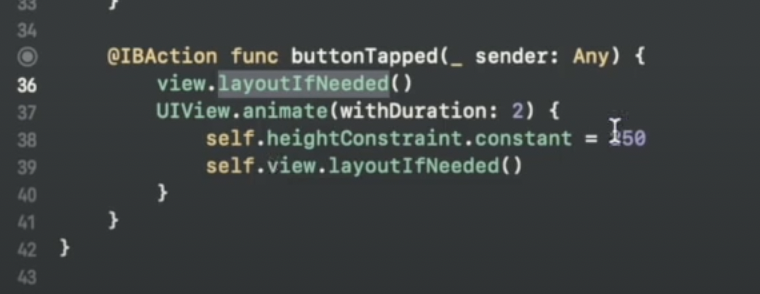

Примеры анимаций

**Пульсирующая кнопка**

```swift

extension UIButton {
    func pulsate() {
        let pulse = CASpringAnimation(keyPath: "transform.scale")
        pulse.duration = 0.6
        pulse.fromValue = 0.95
        pulse.toValue = 1
        pulse.autoreverses = true
        pulse.repeatCount = 2
        pulse.initialVelocity = 0.5
        pulse.damping = 1
        
        layer.add(pulse, forKey: nil)
    }
}

```

**Перемещение view**

```swift

UIView.animate(
    withDuration: 0.5,
    delay: 0,
    options: [.autoreverse, .repeat]) {
    
    if !self.animationStarted {
        self.coreAnimationView.frame.origin.x -= 40
        self.animationStarted.toggle()
    }
}

```

При смене констрейнтов через анимацию, нужно вызвать **LayoutSuviews** через **layoutIfNeeded()**

Подробнее: https://www.youtube.com/watch?v=F4TCmHpYDWY

