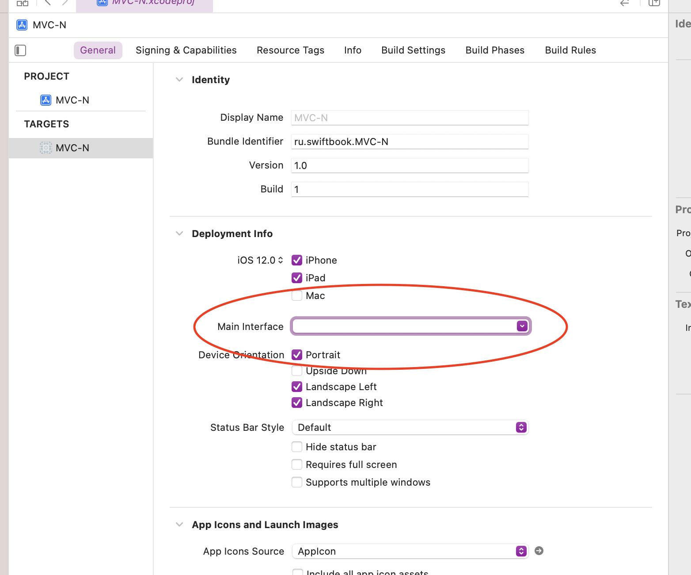
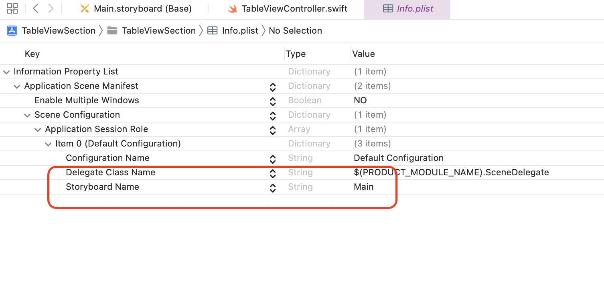
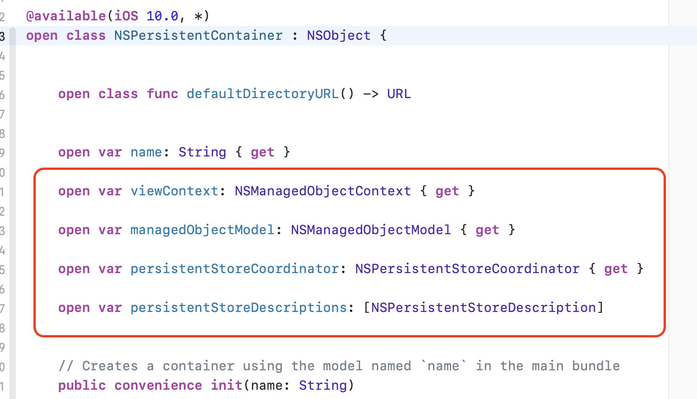

## Ссылки

https://habr.com/ru/post/303512/

## Информация

**Для обработки результатов работы с БД можно использовать замыкания и объект Result** - также как мы действуем с HTTP запросами

**Realm база нужна для универсальных приложений для нескольких платформ (мобильная, веб, десктоп)**, чисто для IOS приложений использовать ее не нужно

**Realm создавалась как СУБД для мобильных платформ**

**Чтобы UI создать программно необходимо:**

-   Удалить Main.storyboard    
-   Очистить строку **Main interface** в настройках проекта  

-   Удалить раздел в файле **info.plist**

    
**Большинство компаний (80-90%) работает без сториборда**

**При программном создании элементов используется синтаксис с описанием объекта в фигурных скобках**, поскольку так удобнее описывать объект, код выглядит более наглядно.

**Свойства для UI делают ленивыми**, поскольку они должны появляться только после инициализации вью в памяти, если их не делать ленивыми - они инициализируются сразу, что приводит к ошикам

**CoreData - нативный фреймворк**, не реляционная БД в виде объектного графа. На самом деле не является настоящей СУБД, скорее оболчка, для работы с сущнастями и их связями. Сущность это тип данных Entity, как класс. Используется для создания моделей. CD это прослойка между разрабочиком и БД (SQLite)

**Чтобы посмотреть объекты, которые связаны с CoreData**, можно открыть класс `NSPersistenContainer`

**Работа с объектами БД происходит в оперативной памяти,** в БД объекты фиксирует слой **Persistent Coordinator.** Данные сохраняются в слое **Persistent store** (память телефона)

`PersistentContainer` **в** `AppDelegate` **по умолчанию сделан lazy**, поскольку при загрузке приложения не факт что нам понадобится это ствойство

**Чтобы добраться до класса AppDelegate из модуля используется UIApplication.shared.delegate**

**Обновление по willAppear можно делать если второстепенный экран** не открывается модально