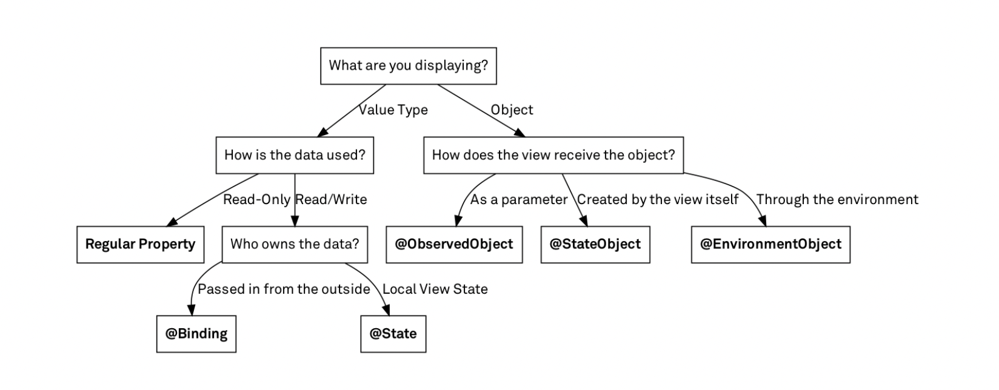

## Общая информация

SwiftUI - это фреймворк. **Представили в 2019 году на конференции WWDC.**

SwiftUI - это универсальный фреймворк для всех систем Apple.

SwiftUI строится на UIKit

До этого использовали **императивный** подход, SwiftUI - это **реактивный** подход. Данные меняются при изменении состояния объектов

**SwiftUI не использует архитектуру MVC**, вместо этого используется MVVM

**Тут нет понятия контроллера**, нет такого слоя.

Будут новые типы данных.

Потребуется **декларативный** подход при написании кода.

В реактивном походе не имеет значение последовательность кода. Как только мы меняем значение, мы сразу видим изменение в UI.

Все элементы UI в SwiftUI это **структуры подписанные под протокол View**, в отличие от UIKit, в котором в основном используются классы

Окно превью по сути заменяет эмулятор, но не полностью. Чтобы было полное соответствие, надо использовать LivePreview

**Многие типы в SUI совпадают с объектами UIKit**, только без префикса UI (UIImage - Image)

**UI в SUI создается кодом**, с использованием декларативного стиля. Также дополнительно можно использовать Attribute Inspector. При изменении свойства, будет происходить изменение кода.

**Инспектор можно вызвать в всплывающем окно**, если кликнуть по элементу с клавишей Command

Каждый вызов метода возвращает структуру графического объекта, по сути это паттерн Фабрика(?)

Элементов UI в SUI больше чем в ките. Помимо библиотеки элементов UI есть библиотека модификаторов.

В SwiftUI используется работа через стеки (аналог групп в 1С). По умолчанию все центрируется в группе.

В SwiftUI нет контстрейнов.

UI принято делить на отдельные файлы.

В SUI пока можно реализовать не все, фреймворк активно развивается.

**Каждый модификатор возвращает копию предыдущего версии объекта**, но с измененным свойством, за который он отвечат.

**Последовательность модификаторов может иметь значение**, но не всегда.

UI в SwiftUI зависит от свойств классов, т.е. фактически UI является отражением состояния класса.

Чтобы свойство можно было использовать в качестве данных, для построения UI, необходимо использовать обертку @State

State свойство должно быть единственным и постоянным источником своего представления. У одного и того же елемента UI не может быть несколько State свойств

**State свойства:**

-   должны быть приватными
-   требуют инициализации
-   должны быть единственным источником данных для элемента интерфейса
    

**Binding свойства:**

-   должны ссылаться на State или другие Binding свойства
-   не требуют инициализации
-   используется если значение должно передаваться вверх по цепочке
    
Подчиненные свойства, которые зависят от State свойств должны быть помечены свойством @Binding. Посути это свойство на другую (State) переменные. Не обязательно инициировать Binding свойства. Для непосредственно передачи значения используется знак $.

State и Binding используютмся только для свойств- значеений. Для ссылочных типов они не подходят.

Чтобы определить зависимость от классов, используют обертку @StateObject. Класс при этом должен быть подписан под протокол ObservebleObject. У класса должно быть объявлено свойство-издатель, который оповещает слушателнй об изменении объекта.

Для зависимых свойств используется обертка ObservedObject

StateObject по сути делают синглтон объекты, поэтому специально стнглтоны делать не надо

Чтобы зависить только от одного свойства, используется оберткп @Published. Когда такое свойство меняется, все следящие объекты будут меняться.

EnvirenmentObject позволяет задействовать глобальные свойства, лишая небходимости создания пар свойст главное - зависимое

В блоке body нельзя тспользовать if-else. Чтобы можно было, используется Group

когда у структуры меняется значение, свифт удаляет старую и создает новую структуру

state и StateObject должны быть созданы по одному

**Модификаторы можно выносить в собственные модификаторы**. Для этого создается структура, подчиненная протоколу ViewModifier

```

import SwiftUI

struct TableImageView: View {
    let size: CGSize
    var body: some View {
        Image(systemName: "table")
            .resizable()
            .frame(size: size)
            .background(Color(white: 0.9))
            .clipShape(Circle())
            .overlay(Circle().stroke(Color.red, lineWidth: 8))
            .foregroundColor(.red)
    }
}

extension View {
    func frame(size: CGSize) -> some View {
        modifier(FrameFromSize(size: size))
    }
}

struct TableImageView_Previews: PreviewProvider {
    static var previews: some View {
        TableImageView(size: CGSize(width: 250, height: 250))
    }
}

struct FrameFromSize: ViewModifier {
    let size: CGSize
    func body(content: Content) -> some View {
        content
            .frame(width: size.width, height: size.height)
    }
}


```

## Совместимость UIKit и SwiftUI

Если есть два проекта, написанные на разных технологиях, мы просто мышкой перетаскиваем модули из одного проекта в другой. Например из SwiftUI в UIKit.

С точки зрения UI SwiftUI работает со структурами, UIKit с классами. Поэтому, чтобы в проекте по SU вызывать UK мы оборачиваем классы UK в структуры

**Чтобы из UK проекте вызывать SU** элементы используется обертка Host???

**Если какой-то элемент в SU не реализован**, его можно интегрировать из UK

## Используемые в SU обертки свойств



**@State** - обертка для value свойств. Пир изменении свойства, структура вью пересоздается заново.

**@Binding** - обертка для связи value свойств, позволяет ссылаться на State свойство из дочернего view. Чтобы свойство можно было не только читать, но и редактировать, используется знак $.

**@StateObject** - обертка для reference свойств. Может вызваться только один раз для при создании объекта. Класс должен быть подписан под протокол ObservibleObject. При этом все наблюдаемые свойства должны быть помечены как @Published.

**@Published** - обертка для свойств объектов, за которыми надо следить.

**@ObservedObject** - обертка для связи reference типов, позволяет ссылаться на @StateObject свойства. Оболочка используется для связи со связанными между собой View. Оболочка не должна создавать объект.

**@EnvirementObject** - позволяет работать с свойствами между классами, у которых нет прямой связи. По сути позволяет реализовать паттерн синглтон. Взаимодействует с свойствами StateObject. В отличие от ObserveObject SwiftUI создает среду для доступа к таким свойствам, доступным из любого места приложения. Каждое представление наследует среду от своего родителя.

**@Envirement** - позволяет получить доступ к системным переменным окружения, например цвету

## List

В SwiftUI **TableView** называется **List**

## Grind

В SwiftUI **CollectionView** называется **Grid**