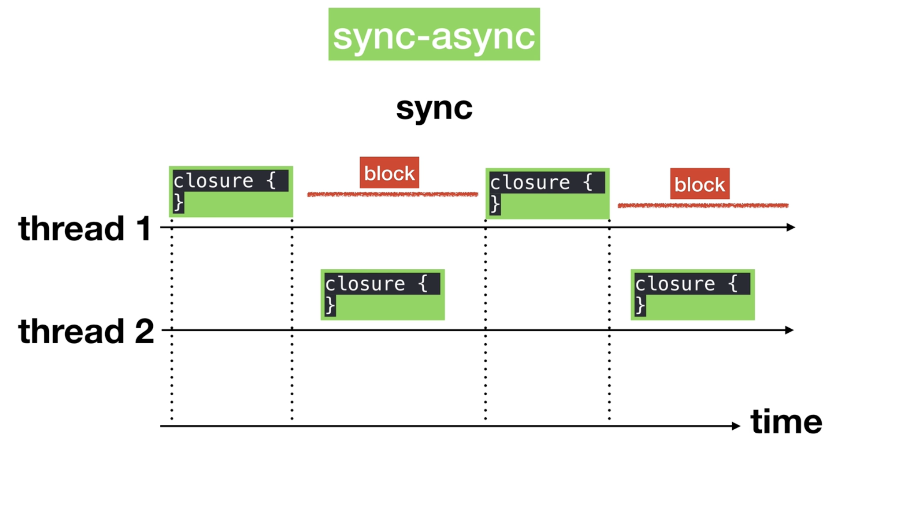

#архитектура #алкоголь 

Компания Apple рекомендует всегда использовать тип Double по умолчанию

## Clean swift

Идеи принципов чистой архитектуры (Clean Swift) принадлежат Роберту Мартину (см. книгу Чистая архитектура). Чистая архитектура строится на принципах SOLID. Роберт Мартин начал их собирать еще в 80х.

**Во всех пересечениях границ архитектуры** используется DI принцип. 

**В CS имеет вложенную архитектуру**. Ядром архитектуры служит бизнес логика. Самым внешним уровнем служит потребители функционала. Внешний уровень архитектуры использует методы внутрнней архитектуры, **но не наоборот**

**Не обязательно все файлы архитектур создавать вручную**. Можно использовать шаблоны и при добавлении новой сцены использовать шаблоны. Шаблоны позволяют создать сразу несколько файлов, при этом при добавлении их, можно указать имя-префикс этих файлов.

Когда код создается из шаблонов, если название методов необходимо адаптировать под специфику приложения, используется переименование через рефакторинг. Т.е не обязательно в имена методов закладывать некий шаблон.

**Если класс помечен как** `final` - Swift работает с ним **быстрее**

**AnyObject - это typealeas**, а не какой-то отдельный тип

**Если мы хотим чтобы метод у супер класса был переопределен**, при его описании можно заложить вызов исключения. По сути таким образом можно создать абстрактный класс.

**У коллекций есть встроенные итераторы**. Объявляются они примерно так

```swift

let anyArray = [1, 2, 3]
var iterator = anyArray.makeIterator()

while let item = iterator.next() {
	print(item)
}

```

**Чтобы реализовать собственный итератор**, надо имплементировать протокол `Sequence`

## DCP

**Одно ядро процессора может использовать только один поток (thread) единовременно**. Если задач несколько, они будут выполняться последовательно. Если ядра два, на каждое ядро может приходится отдельный поток и отдельный ряд задач. При этом если задачи не взаимосвязаны, они могут безболезненно выполнятся в каждом потоке независимо друг от друга.

Есть два вида задач:
- **Serial queue** - последовательное выполнение задач (используется прицип FIFO)
- **Concurrent queue** - согласованная очередь

**Serial queue** - несмотря на то что очередь одна, потоков может быть несколько, при этом задачи все равно будут выполняться последовательно

**Concurrent queue** - задачи выполняются параллельно по потокам

**Main queue** - используется только для обновления UI. Main queue - это Serial queue

**Синхронное, асинхронное выполнение задач:** если задачи выполняются асинхронно, они могут выпобняться параллельно, каждая в своем потоке. Если задача выполняется синхронно, они выполняются последовательно, даже если находятся в разных потоках.

**Код в главном потоке можно выполнять как синхронно, так и асинхронно**. Тоже самое и в глобальном потоке.

**Race condition** - ситуация, когда два потока меняют один и теже данные (например заполняют массив), из-за чего результат работы приложения становится непредсказуемым.

Для того чтобы бороться с RC есить различне стратегии:
- Установить барьер на такск

QOS позволяет управлять приоритетом приложений в рамках процессора.

`defer` **метод удобно использовать в участках кода**, где требуется обязательное выполнение кода, если при его выполнении возникнет ошибка. 

**По заявлению автора сишные методы по работе с потоками работают быстрее** в 15-20 раз быстрее чем GCD swift методы. Требуется подтверждение.

Потоки - это низкоуровневая сущность. Используею GCD мы оперируем очередями, без обращения к самим потокам.

Синхронное/асинхронное выполнение не зависит от количества потоков.

Синхронное выполнение может происходить и в нескольких потоках. При этом в момент времени выполняться будет только один поток, несмотря на то, что задачи запущены например в двух потоках. В момент выполнения задачи в одном потоке, второй ждет. После завершения выполнения задачи, управление может перейти к первому потоку, тогда второй поток ждет.
      

	  
Apple заложила 5 предопределенных очередей:
- Main queue - очередь по умолчаню, работает всегда.

В Playground можно отображать UI элементы

```swift
      
import UIKit

import PlaygroundSupport

class MyViewController: UIViewController {

	override func viewDidLoad() {

		super.viewDidLoad()

		title = "Hello world"

		view.backgroundColor = .red
	}
}
  
let myViewController = MyViewController()

let navigationBar = UINavigationController(rootViewController: myViewController)

navigationBar.navigationBar.backgroundColor = .white 

PlaygroundPage.current.liveView = navigationBar

```

**Если в методе есть параметры по умолчанию**, в свифте автоматически создается сигнатура метода без этого параметра

**Удобный метод для выполнения операций в цикле через очередь**  -DispatchQueue.concurrentPerform. Выполнение операций происходит в разных потоках.

**Альтернативой DispatchQueue является Operation**. Он позволяет отменять запущенные задачи.

**Playground выполняется в основном потоке** и после чтения последней строчки кода завершает работу. Чтобы этого не происходило мы включаем режим постоянного выполнения

```swift

import PlaygroundSupport

PlaygroundPage.current.needsIndefiniteExecution = true

```

**DispatchItem позволяет управлять выполнение кода более гибко**: останавлитвать, отменять, возобновлять

**Когда мы вызваем DispatchQueue:**

```swift

var queue = DispatchQueue()

```

мы только создаем очередь. Когда вызваем 

```swift

queue.async {
	//...
}

```
мы отправляем в очередь выполнение кода клоужера

**В классе нельзя создавать неинициализированные свойства - константы**. Только переменные

## MVVM

View не должна ничего знать про модели данных

View Не должна напрямую обращаться к сервисному слою (не ей решать откуда брать данные, как сохранять и тд)

Во View не должно происходить никакой логики

Если функционал может обойтись без UIKit - его надо выносить во ViewModel

ViewModel слой ничего не должен знать про UI. Те мы не импортируем UIKit

ViewModel должнать знать про модель данных, из них она и берет данные. View не должна знать про модель данных, не должна обращаться к свойствам.

ViewModel опирается на данные, которые мы должны отобразить в интерфейсе
Онаже содержит бизнес логику

Нужно добиться чтобы View была настолько простоя, что ее вообще не нужно было тестировать. Вместо этого мы будем тестировать ViewModel

На одну сцену может приходится два файла: View и ViewModel. При этом имя папки должно предствлять собой имя сцены, это же имя должно учавствовать в качестве префикса файлов.
