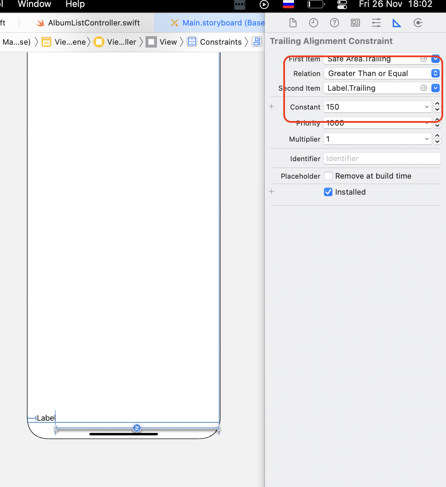
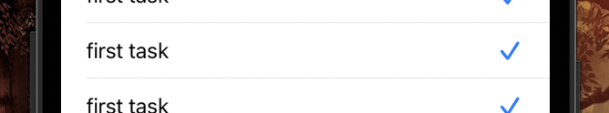

**Глюк Xcode - если скрыта панель свойств (автоскрытие)** - не удается выбрать кастомный цвет для элемента

**Чтобы ограничить ориентацию приложения**, надо поменять следующие строки (если не работает соответствующий флаг в настройках приложения)


**UITableViewController это всего лишь** `UIViewController` + 2 протокола. С основным свойством `tableView`


**UICollectionViewController это всего лишь** `UIViewController` + 2 протокола. С основным свойством `collectionView`


**Для того чтобы управлять констрейнтами программно,** на них тоже можно делать аутлеты

**Информация, что такое ViewController:**

https://developer.apple.com/library/archive/featuredarticles/ViewControllerPGforiPhoneOS/index.html#//apple_ref/doc/uid/TP40007457-CH2-SW1

**Чтобы получить ширину коллекции (TableView, CollectionView)** можно использовать код вида:

`collectionView.frame.width`

**Размещение элементов в CollectionView может быть с типом Flow или Custom**. Если выбран Flow, поскольку этот вид поставляется Apple, в панеле свойств мы можем увидеть элементы, для управления свойствами элементов коллекции (размер, отсутпы и тд). Также эти свойства можно определять через делегат `UICollectionViewDelegateFlowLayout`. Этот вариант предпочтительнее.


Выбор лайаута


Набор свойств для Flow

**Программно настроить отображение элементов в CollectionView** можно через:

-   Делегат `UICollectionViewDelegateFlowLayout`
-   Через свойство `collectionView.collectionViewLayout`
    
Реализация в сниппетах

**Ошибка**

> **Warning once only: Detected a case where constraints ambiguously suggest a height of zero for a table view cell's content view.**

Возникает, когд для таблицы со статичными стоками не установлена высота по умолчанию. Высоту надо установить для всей таблицы

**Объяснение проблемы с заменой изображений в ячейках**

> Это неправильное функционирование такого простого приложения. В чем же дело? Дело в том, что ячейки в таблицы являются повторно-используемыми благодаря методу `dequeueReusableCell`. Каждый раз, когда ячейка (новая или повторноиспользуемая) попадает а экран, запускается асинхронно загрузка изображения из сети (в это время крутится «колесико»), как только загрузка выполнена и изображение получено, происходит обновление `UI` этой ячейки. Но мы не ждем загрузки изображения, мы продолжаем прокручивать таблицу и ячейка (**«Кассини»**) уходит с экрана, так и не обновив свой `UI`. Однако снизу должно появится новое изображение и эта же ячейка, ушедшая с экрана, будет использована повторно, но уже для другого изображения (" Арктика"), которое быстро загрузится и обновит `UI`. В это время вернется запущенная в этой ячейки ранее загрузка «Кассини» и обновит экран, что неправильно.Это происходит потому, что мы запускаем разные вещи, работающие с сетью в разных потоках. Они возвращаются в разное время:
> 
> Как мы можем исправить ситуацию? В пределах механизма `GCD` мы не можем отменить загрузку изображения ушедшей с экрана ячейки, но мы можем, когда приходят наши `imageData` из сети, проверить `URL`, который вызвал загрузку этих данных, `url` и сравнить его с тем, который пользователь хочет иметь в этой ячейки в данный момент, `imageURL`:

**Важным свойством для СollectionView является Scroll direction** - вертикальное или горизонтально. Определяет порядок заполнения элементами.

**Все классы в Swift наследуются друг от друга**, выстраивая большое дерево

**Документация по анимации распологается по адресу**:

https://developer.apple.com/library/archive/documentation/Cocoa/Conceptual/CoreAnimation_guide/Introduction/Introduction.html

**Атрибут** `@IBDesignible` **позволяет отображать в Storyboard изменения объектов**, которые мы делаем в коде

**Чтобы контролировать перекрытие клавиатурой текста**, необходимо добавить два наблюдателя через NotificationCenter на изменение размера клавиатуры и ее скрытие. В обработчике смещать текст с учетом величины констрейнта, для него придется сделать аутлет (см. сниппеты)

**Ширину кнопки нужно не фиксировать константой, а выбирать >=**, при установке ширины, иначе Xcode будет выдавать предупреждения

**Чтобы картинка не выходила за границы вью**, надо установить флаг - **Clip to bounds**

**Кастомизировать под размеры экрана можно не только констрейнты**, но и например особенности выравнивания в Stack view


**Core Animation нужен** чтобы разгрузить CPU и упростить работу с GPU.

**Помимо Core Animation можно использовать другие фреймворки для работы с анимацией**, но они более сложные и как правило хватает CA

**CA позволяет работать с объектами класса UIView**. Когда мы создаем объект UIView (кнопка, лейбл, слайдер и тд) у него есть свойство layer типа CALayer (например `myButton.layer`). Как раз в этом классе содержится модель того, как у нас будет отображаться объект. UIView это делегат объекта CALayer. CALayer отправляет модель картинки на железо Hardware. Hardware уже отображает картинку.


**Чтобы скруглить изображение**, надо сначала скруглить View, а потом придать форму изображению наложив маску:

```

imageView.layer.cornerRadius = imageView.frame.size.height / 2 imageView.layer.masksToBounds = true

```

Размер констрейнта можно установить точно, а можно использовать множетель _Multiplier_


**Чтобы клавиатура закрывалась при касании экрана**, можно в обработчике `touchBegan` вызвать метод `view.endEditing()`

**Если при импортировании изображений** им задать имена с шаблоном @2x, @3x - они автоматически будут распознаны как изображения для разных расширений экрана

**Чтобы шрифт автоматически уменьшался** при изменении его границ, надо установить свойство Autoshrink


**Для установки начальных значений слайдера**, можно использовать обсервер - тогда значения будут устанавливаться в момент инициализации

```

@IBOutlet weak var slider: UISlider! { 
	didSet {
		slider.maximumValue = 100
		slider.minimumValue = 0
		slider.value = 0
	}
}

```

**Unwind segue можно привязать не только к кнопке**, но и к контроллеру. Для этого луч контроллера нужно перевести на иконку выхода.


**Констрейнты можно удалить:**

-   В дереве элементов
-   В панеле свойств  
      

    
-   Через меню нижней кнопки


    
**При привязке элементов тремя кострейнтами,** один из них должен быть динамичным, чтобы адаптироваться под ширину экрана, такому констрейнту нужно устанавливать значение: Grater then or Equal

**Когда мы строго пытаемся зафиксировать ширину элемента с текстом**, Xcode предупреждает, что это может вызвать проблемы при локализации и предлагает сделать ширину констрейнта не жестко фиксированной, а динамической


Xcode изменил признак Relation

**Чтобы адаптация констрейнта была универсальна для всех устройств**, включая маленькие экраны, динамическому констрейнту можно установить произвольное минимальное значение (как в примере 150). Главное сделать его Greater Than or Equal. В таком случае он будет всегда адаптироваться под экран



**Констрейнт AspectRatio нужен**, чтобы фиксировать взаимосвязь размеров объектов, с размерами других объектов:

-   например взаимосвязь высоты и ширины объекта
-   взаимосвязь высоты объекта и высоты экрана (View)
    
**При установке AspectRatio важно правильно выбрать** коэффициент увеличение и ориентир для формирования размера

**Приоритет констрейнтов может понадобиться**, когда при определенных условиях констрейнты начинают противоречить друг-другу. Например когда мы выбирали AspectRatio, при этом объект так растянулся, что нарушил констрейнт по SafeArea. Чтобы этого избежать, нужно у ломающего констрейнта установить Priority с 1000 на 999. 1000 - это максимальный приоритет.


**Привязку элементов к аутлетам можно посмотреть**:

-   По ПКМ  
      

    
-   Через палитру свойств  
      

    
-   Наведя луч на контроллер  
    

    
**Чтобы увидеть все подписанные у View аутлеты**, можно выделить контроллер и посмотреть палитру свойств:


**ViewController - это контейнер в котором мы располагаем все что нам нужно**, например View, TableView и тд

**Чтобы при обратном сигвее передать информации от дочернего VC к родительскому**, надо обратиться к свойство source

```

@IBAction func unwind(for segue: UIStoryboardSegue) {
    guard let settingsVC = segue.source as? SettingsViewController else { return }
    minimumValueLabel.text = settingsVC.minimumValueTF.text
    maximumValueLabel.text = settingsVC.maximumValueTF.text
}

```

**Встроенные протоколы делегаты типа UITextFieldDelegate, UITableViewDelegate** - позволяют реализовать обработку событий для соответствующих элементов, при этом в качестве источника кода мы указываем контроллер, как правило текущий. Для отображения данных в TableView UITableViewDelegate не нужен, он нужен только если требуется обработка событий с TV

**После создания сигвея**, его можно увидеть в дереве объектов, а также можно дополнительно настроить в панеле инспектора


**Чтобы установить цвет для NavigationController** надо в настройке проекта:

-   **Status bar style** установить значение **Light Content**
-   В info.plist установить ключ **View controller-base status** bar appearance в значение **NO**
    
**Методы tableView(trailingSwipeActionsConfigurationForRowAt) по назначению похож на tableView(commit editingStyle)**, но первый метод это протокол TableViewDelegate, а второй - TableViewSource. Насколько я понял, это подразумевает, что второй метод должен менять сами данные (изначально там заложено удаление и вставка), а первый универсальный - просто создает меню, которое может выполнять любую функцию

**UITableViewController это расширенный вариант класса UIViewController.** Помимо прочего он добавляет свойство tableView через которое мы можем взаимодействовать с таблицей

**UITableView унаследован от UIScrollView** - это дает ему возможность скролить контент

**90 процентов объектов UIKit - это классы**. Структуры в нем появились относительно недавно

**UITableViewCell содержит в себе объект UIView - это тот же View**, что мы используем когда создаем обычный UIViewController. Соотвественно он поддерживает все теже самые манипуляции

**Когда для TVC мы вибираем ее тип в инспекторе,** в дереве объектов можно увидеть как появляются элементы (Label, Image). При виде **Custom View** остается пустым


Basic


Right detail

**Если сигвей делаем от контроллера,** а не от элемента, обязательно надо указать идентификатор сигвея

Чтобы в NavigationBar появилась кнопка Edit которая поставляется из коробки, ее необходимо инициализировать строкой:

`navigationItem.leftBarButtonItem = editButtonItem`

**StoryBoard по сути это набор xib файлов**. На текущий момент Apple рекомендует его, для создания UI. На практике UI часто создается кодом. На StoryBoard мы видим сцену, на которой располагается View.

**От UIView произошли все элементы интерфейса**. т.е. UIView является для них прородителем.

**xib (Xcode Interface Builder) файлы** - это “холст” для отрисовки UI

**nib (Next Step Interface Builder) файлы** - это устаревший “холст” для создания UI

**Скруглить углы** можно через код, а можно через Identity inspector. Но злоупотреблять этой формой не нужно, приоритет за установку свойств через код.


**Установить ширину равную ширине другого объекта** можно перетянув луч на объект-источник и выбрав меню:


**CollectionView и TableView используются для отображения бесконечных лент**. Если в ленте есть горизонтальный скролинг, скорее всего это CollectionView. TableView вроде как используется чаще.

**Ячейка в CollectionView не имеет предопределенных элементов для заполнения** (картинки, текста), в отличии от ячейки **TableView,** поэтому ее приходится настраивать вручную используя кастомный класс

**CollectionView имеет больше возможностей чем TableView**, поэтому позволяет делать более интересные вещи

**В контроллере при обращении к основным элементом через view, tableView** по сути идет к полям соответствующих классов. В классах они просто объявлены через var.

```

open var tableView: UITableView!
open var view: UIView!

```

**Внешний вид элементов обычно настраивают через код,** т.е. не через инспектор - точка зрения автора видеокурса. Ефимов же считает, что если мы используем storyboard, то настройку нужно производить через inspector.

**В качестве анимаций лучше выбирать .automatic**, система сама решить какую анимацию использовать.

**В IO 15 пустые строки tableView не отображаются**, в отличие от более ранних версий

**Перед удалением данных в TableView необходимо удалить данные в данных** - иначе возникает ошибка несоответствия количества строк

```

taskList.remove(at: indexPath.row)
tableView.deleteRows(at: [indexPath], with: .automatic)

```

**Установить для ячейки флаг выполнения или детализации можно через свойство accessoryType.** Выглядит это следующим образом:




**При загрузке изображений из сети в TableView нужно контролировать совпадение URL исходного запроса и URL картинки**, поскольку система возвращает результат запроса не в соответствующий индекс массива данных, а в индекс отображаемой коллекции, где первая строка всегда имеет индекс 0, а последняя, индекс в зависимости от размера экрана.

**Чтобы настроить ширину и высоту ячейки CollectionVeiw нужно подключать протокол UICollectionViewDeligateFlowLayout**, в отличие от TableView, где высоту можно выбрать при выводе ячейки.

**Чтобы ActivityIndicator автоматически скрывался после остановки анимации**, можно использовать свойство `hidesWhenStopped`

**Если используется tableView - activity indicator нужно реализовывать программно**

**Обновление UI элементов можно привязать к изменению данных через обсерверы**. Например при изменении массива данных, в `didSet` вызвать метод `reloadData()`

**Чтобы поместить существующие элементы в ScrollView,** делаем также как и со Steak - выделяем элементы

**Заполнение ячейки таблицы** часто реализуют через создание метода в контроллере ячейки, с передачей в него объекта данных

**Конструктор может возвращать nil - init?()**, может использоваться, когда при создании объекта должна быть предварительная проверка. В случае если проверка не пройдена - объект не создается

**Type alias удобно использовать когда тип имеет длинный вид**, например у нас есть словарь [String: Any]. Чтобы все время не дублировать описание этого типа, можно использовать алиасы

**При программном создании UI необходимо указать стартовый контроллер** в классе AppDelegate или SceneDelegate

**UITableViewController и UICollectionViewController наследуются от класса UIViewController и специфических делигатов**. Каждый из них имеет свое свойство, для работы с колеццией

**Установить источник программной логики для tableView (dataSource, delegate)** можно через код, а можно лучом, связав таблицу с контроллером. Для первого способа необходимо создать аутлет на таблицу, и присвоить в качестве делегата и источника данных текущий котроллер.


**Чтобы шрифт автоматически адаптировался под ширину экрана,** справа и слева нужно установить констрейны, а для шрифта установить Autoshrink в значение Minimum Font Scale и установить коэффициент масштабирования шрифта.

**Если у TextLabel установить 0 в качестве количества строк** - высота будет рассчитываться автоматически

**Чтобы переименовать аутлет**, нужно это делать через **Refactoring - Rename**

**Высоту/ширину одного элемента можно привязать к высоте/ширине другого элемента** - для этого при наведении луча констрейна надо выбрать **Equal width/Equal height**

**Чтобы высоту и ширину сделать зависимыми от размера экрана**, луч с элемента нужно перевести на view и выбрать **Equal width/Equal height**

**Для установки зависимости высоты и ширины** необходимо навести луч на себя и выбрать **Aspect ratio**

**Метод viewDidLoad знает только размеры элементов** те, которые указываются при разработке. Реальные размеры объектов известны только на **viewWillLayoutSubviews.** Поэтому в этом методе указывают например величину скругления, которая зависит от ширины элемента.

**Чтобы понять какое свойство элемента нужно изменить,** для получения нужного эффекта, можно для начала найти это свойство в inspector.

Разница между bounds, frame, layer -

**AlertController по сути тот же самый ViewController**, даже для отображения мы используем тот же метод, что и при обычном ViewController - `present`

**При присвоении элементу UI значения, всегда происходит его обновление,** даже если по факту значение не меняется, поэтому нужно отслеживать это при присвоении значений элементам UI и не делать присвоение, когда оно не нужно

**Для iPhone используется два вида перехода между экранами: Show и Present modal**. Остальные используются в iPad.

**Show** - работает только с Navigation controller. Открытие экрана происходит справа налево, слайдом. При этом второй экран наследует Navigation controller

**Present modal** - экран открывается снизу вверх. Navigation controller не наследуется

**Вид перехода нужно выбирать с умом.**

**Для модального перехода Apple рекомендует наличие кнопки Cancel**, несмотря на наличие свайпа

**Метод prepareForSegue вызывается всегда**. Мы его переопределяем для того чтобы настроить контроллеры для перехода.

**В методу prepare мы не можем из родительского экрана обратится к аутлетам дочернего**, поскольку на этом этапе они не инициализированы. Инициализация будет происходить после инициализации **view**. Признаком того, что view загружен является вызов метода **viewDidLoad**

**Чтобы реализовать обработку перехода дочернего экрана к родительскому**, в родительском экране надо добавить BIAction метод unwind, а в дочернем экране лучем кнопки навести на иконку закрытия и выбрать ранее созданный метод. У метода первый параметр должен быть типа UIStoryboardSegue


В родительском VC готовится метод для перехвата обратного сигвея


В дочернем VC луч кнопки наводится на пиктограмму выхода


Выбирается метод родителького VC

**Разрабатывать приложения надо сразу под маленькие экраны**, чтобы оно было универсальным и подходило под все экраны

**Если при переходе на другой VC вызвать модальное View,** например Alert, тогда метод prepare не вызывается

**Делегаты элементов (TextView, TableView) можно указывать через storyboard, а можно через код**. Например ниже мы подписали VC под протокол, для реализации завершения ввода данных в текстовом поле. Мы указали что VC является делегатом, для имплементации метода завершения редактирования.


**Чтобы текстовое поле сделать активным**, нужно использовать метод `becomeFirstResponder`

`passwordTextField.becomeFirstResponder()`

**Чтобы кнопка в StackView не растягивалась на всю ширину**, в параметре **Distribution** необходимо выбрать вариант **Center**


Е**сли есть NavigationController у дочернего экрана**, то переход нужно делать на него, а не на View с которым связан этот NC

**Если переход осуществляется не по кнопке, а по событию**, VC надо связать между собой через первую иконку View. При этом сигвею нужно установить ID.


**Чтобы сделать разные констрейны для разных экранов**, нужно нажать на плюсик рядом с констрейном. Типы экранов делятся по размерам сторон - **Compact - Regular**, **Compact - Compact**


**Во время разработки, чтобы временно скрывать элементы**, можно убирать флаг **install. Xcode** при этом выдаст предупреждение о том, что есть скрытые элементы.


**Чтобы имитировать переключение страниц в рамках одного view**, используются Stack View с управлением их видимостью. Аналога страниц как в 1С - нет. При этом понадобиться добавить все SteckView в качестве аутлетов.

**TabBar и NavigationBar - это абстракция**, в том виде, как мы их видим в storyboard

**Свойства в VC объявляются с принудительным извлечением опционала** **(var anyProperty: User!)** поскольку:

-   В классах не опциональные свойства обязательно должны быть инциализированы в конструкторе, но конструкторы в VC мы не используем
-   Если использовать обычный опционал, придется все время использовать опциональную цепочку
-   Принудительный опционал показывает, что значение у нас в любом случае будет, а если это не так, приложение имеет право скрашится, что просигнализирует нам, что мы не польностью настроили VC
    
**Чтобы обойти несколько элементов UI в цикле**, не обязательно предварительно создавать массив этих объектов. Можно использовать следующую конструкцию:

```

for button in [button1, button03, button03] {
  button.setTitle("Button")
}

```

**Если нет возможность сделать передачу данных через сигвеи**, это можно делать через делегаты

**Делегирование по сути это когда вызов метода происходит в одном классе,** а реализация - в другом

**Чтобы программно завершить ввод данных** во view, необходимо вызвать метод:

`view.endEditing()`

**Создание TableView во ViewController** (это не оптимальный вариант создания TV, описывается просто для понимания процесса)

-   Добавляем TableView
-   Назначаем делегаты:
    -   или лучем назначаем делегаты для TV (dataSource и delegate - не обязательный протокол)
    -   или создаем аутлет таблицы и кодом
-   Подписываем ViewController под протоколы UITableViewDataSource и UITableViewDelegate (не обяательный)
-   Имплементируем методы
    
**Для TableView по рекомендациям Apple обязательно** нужны NavigationBar